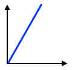

Today's data are shown in Fig. @fig:today, and yesterday's data are shown in Fig. @fig:yesterday.

{#fig:today}

{#fig:yesterday}

Earlier data are shown in Fig. @fig:earlier:

 1. Fig. {@fig:earlier}a is for two days ago; and
 2. Fig. {@fig:earlier}b is for three days ago.

{#fig:earlier .wideimg}

The curves in Figures {@fig:today}--{@fig:earlier} (@fig:today,@fig:yesterday,@fig:earlier) have positive slopes.

